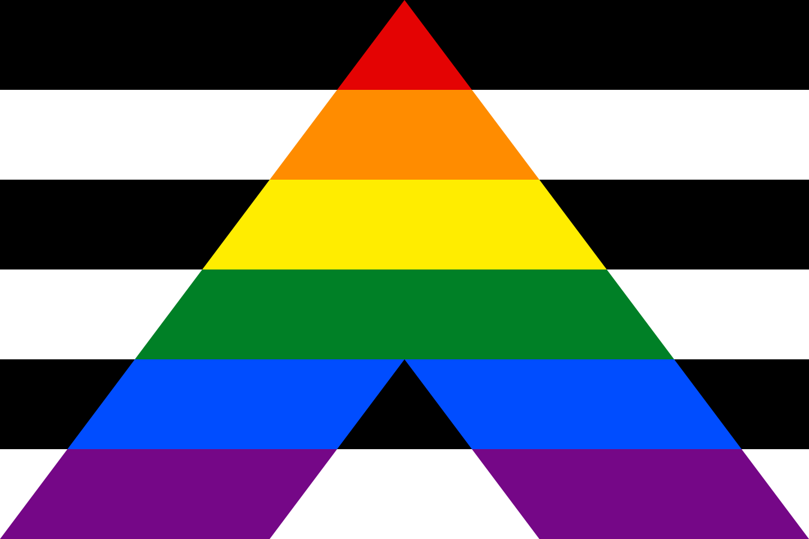
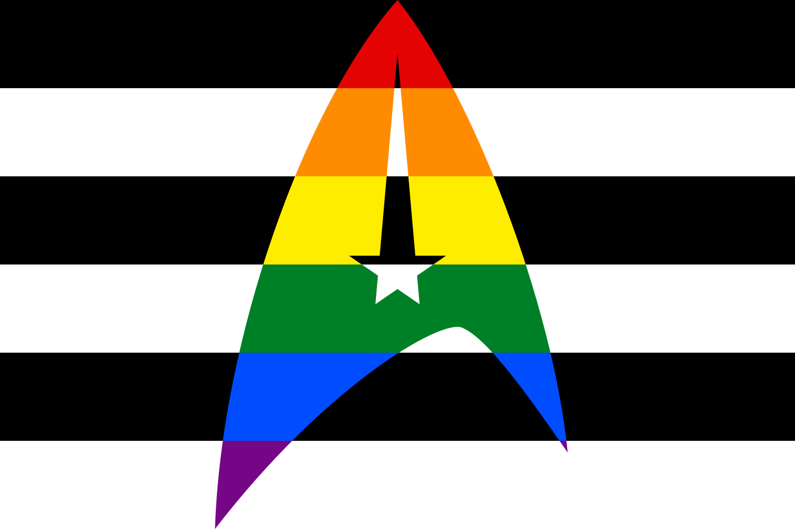
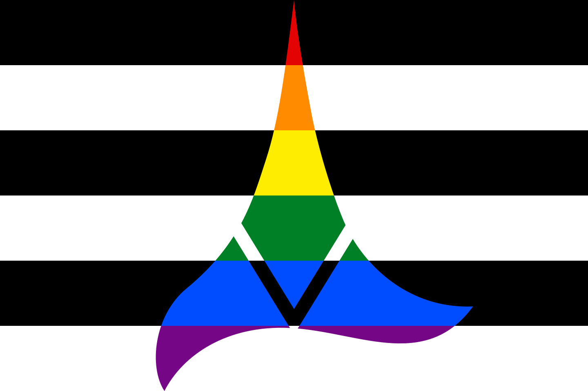
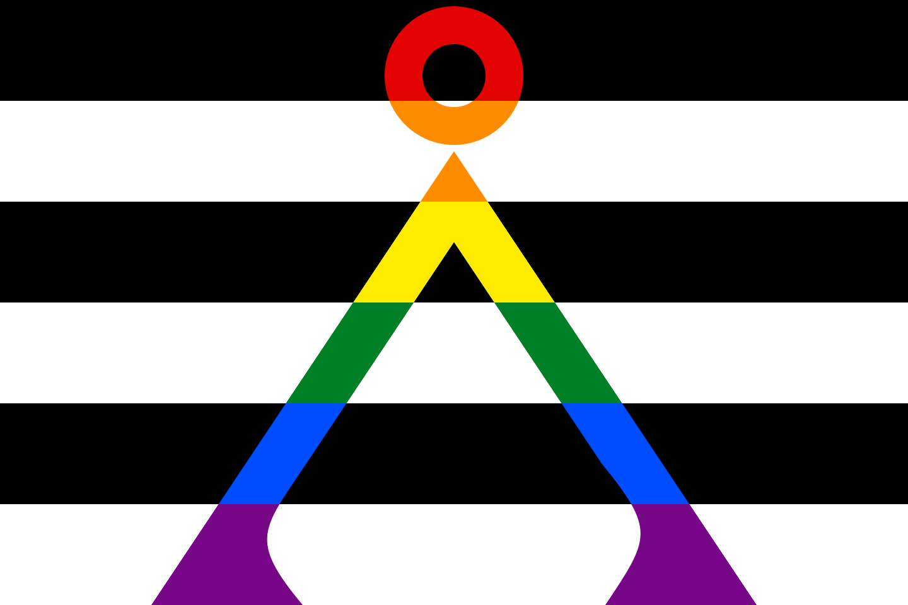
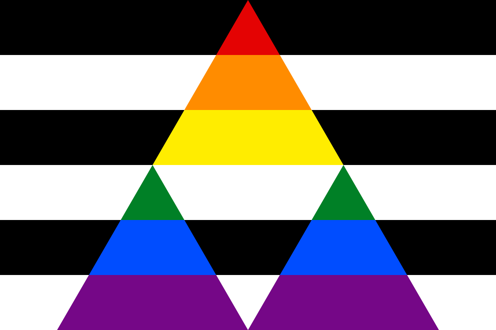
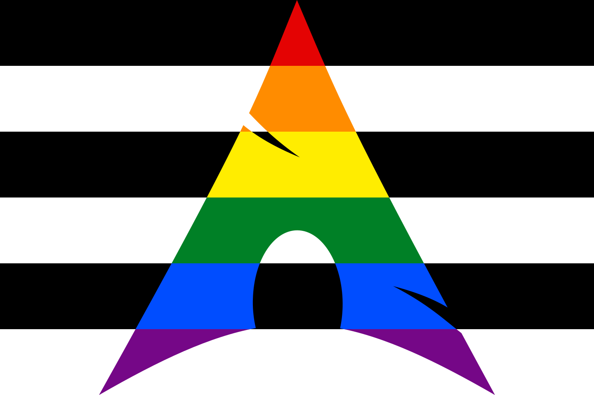

Ally Flags
==========

Some variations on the LGBTQIA+ ally flag/straight ally pride flag, just for
fun.

* [Regular](regular)
* [Starfleet Delta](starfleet-delta)
* [Klingon Insignia](klingon-insignia)
* [Stargate Earth Symbol](stargate-earth-symbol)
* [Triforce](triforce)
* [Arch Linux](arch-linux)

### Regular

The [LGBTQIA+ ally flag/straight ally](https://lgbtqia.fandom.com/wiki/Ally)
pride flag.

### Starfleet Delta

The insignia of Starfleet from the [Star Trek](https://www.startrek.com/)
franchise.

### Klingon Insignia

The insignia of the Klingon empire from the
[Star Trek](https://www.startrek.com/) franchise.

### Stargate Earth Symbol

The symbol of earth on the stargate from the
[Stargate](https://mgm.com/franchise/stargate) franchise.

### Triforce

The triforce from [The Legend of Zelda](https://zelda.nintendo.com/) video game
by Nintendo.

### Arch Linux

The logo of [Arch Linux](https://archlinux.org/).

License
-------

You can consider my work on this as licensed under
[Creative Commons Attribution-NonCommercial-ShareAlike 4.0 International](https://creativecommons.org/licenses/by-nc-sa/4.0/deed.en),
though I don't think that matters much for the logos belonging to other people
and organizations. Rights to those belong to the respective parties, of course.
